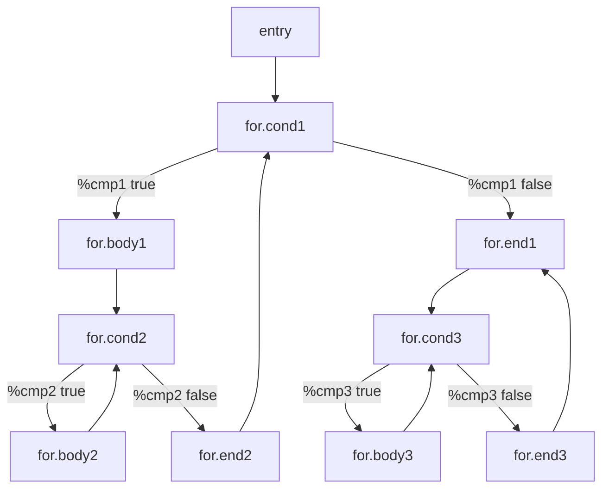
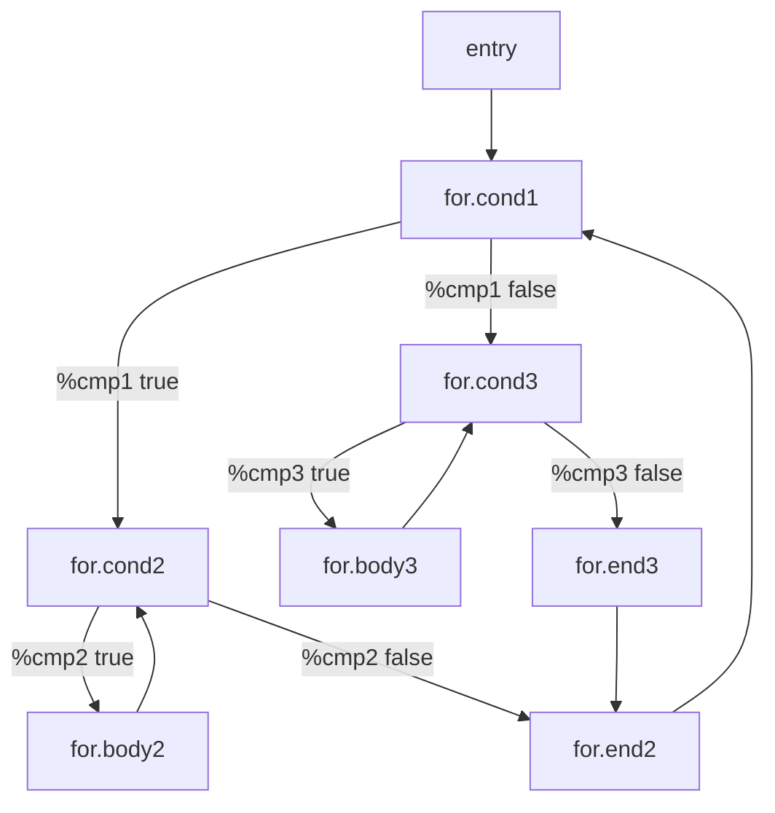

## Usage


### Install LLVM 15.0

```bash
wget https://github.com/llvm/llvm-project/releases/download/llvmorg-15.0.0/llvm-project-15.0.0.src.tar.xz
tar xvf llvm-project-15.0.0.src.tar.xz
cd llvm-project-15.0.0.src; mkdir build;
cmake -B build/ -S llvm/ -DCMAKE_C_COMPILER="clang" -DCMAKE_CXX_COMPILER="clang++" -DLLVM_USE_LINKER=lld -DCMAKE_BUILD_TYPE="Debug" -DLLVM_TARGETS_TO_BUILD="X86" -DLLVM_INCLUDE_BENCHMARKS=Off -DLLVM_FORCE_ENABLE_STATS=ON
```

In project directory, do

```
make clean && make
```

this will compile the passes into `.so` file placed in `build/` directory.

Then, to run the optimization sequence, do

```
make optimize PROGRAM=<your_program_name>
```

where `<your_program_name>` is the name of the program you want to optimize in `test/` directory in `.ll` format.

Also you can directly optimize from `C++` source code by doing

```
make optimize-real PROGRAM=<your_program_name>
```

where `<your_program_name>` is the name of the program you want to optimize in `test/` directory in `.cpp` format.


Then you will see an analysis printed out, the `LA_test.ll` with the following CFG (For the LLVM IR)



However, we must know that when we run the Loop analysis, we're running on Machine IR, so the CFG will be different from the above one.




## Following are given
From the directory containing this file, execute the following commands
```
mkdir build; cd build; cmake ..; make -j
```
This should configure and then build the four passes into a single file ``
which you'll then need to run with LLVM `opt`.
Note that you should use the `opt` of LLVM installation that `cmake` found.
If you're not certain which LLVM that is, search for `LLVM_DIR` in `build/CMakeCache.txt`.
You can run _just_ your passes like this:
```
opt -load-pass-plugin=build/libUnitProject.so -passes="unit-licm,unit-sccp" <input> -o <output>
```
which will probably not do much on their own; or use the full optimization sequence given in the PDF.
