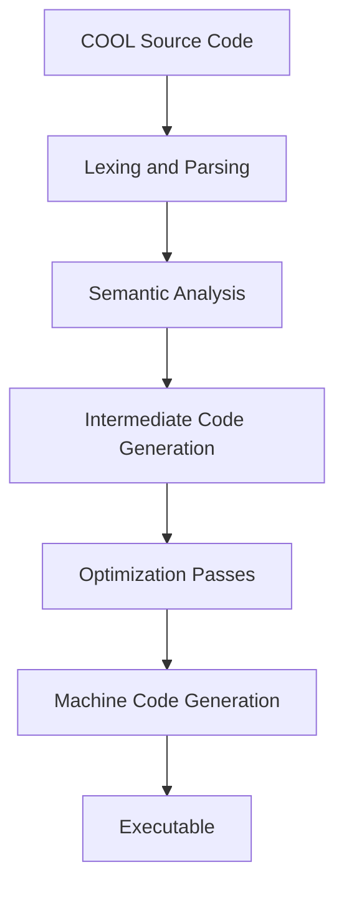
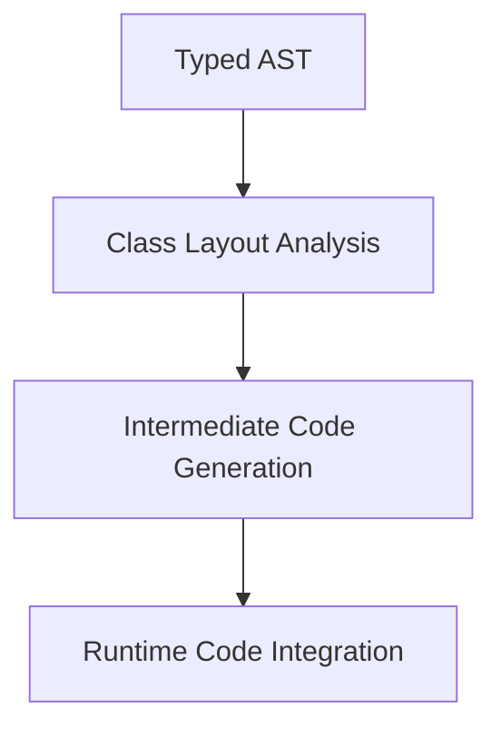
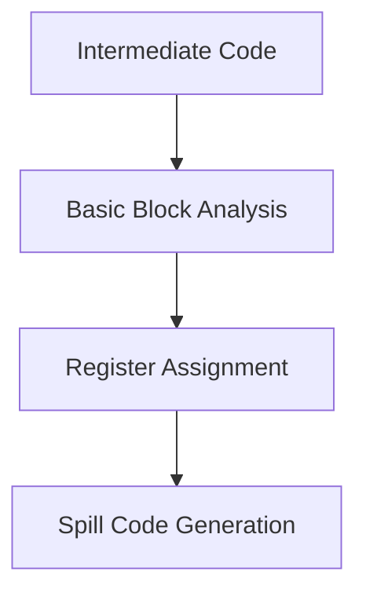

# COOL Compiler Project Documentation

## 1. Usage
### Install LLVM 15.0
To set up the project, ensure LLVM 15.0 is installed on your machine:

```bash
wget https://github.com/llvm/llvm-project/releases/download/llvmorg-15.0.0/llvm-project-15.0.0.src.tar.xz
tar xvf llvm-project-15.0.0.src.tar.xz
cd llvm-project-15.0.0.src; mkdir build;
cmake -B build/ -S llvm/ -DCMAKE_C_COMPILER="clang" -DCMAKE_CXX_COMPILER="clang++" \
    -DLLVM_USE_LINKER=lld -DCMAKE_BUILD_TYPE="Debug" -DLLVM_TARGETS_TO_BUILD="X86" \
    -DLLVM_INCLUDE_BENCHMARKS=Off -DLLVM_FORCE_ENABLE_STATS=ON \
    -DLLVM_ENABLE_PROJECTS="clang" -DLLVM_FORCE_ENABLE_STATS=ON 
```

### Build the Compiler
To compile the project and fully test the pipeline, run:

```bash
make
```

### Run a COOL Program
To compile and run a COOL program:

```bash
make run PROGRAM=<program_name>
```

For example, to run the `assign1o` program in the `test/` directory:

```bash
make run PROGRAM=assign1o
```

This will execute the following pipeline:

```bash
FrontEnd/bin/lexer test/assign1o.cl | FrontEnd/bin/parser | ./bin/semant | CodeGen/bin/cgen-2 > Optimization/tests/testing/assign1o.ll 2>/dev/null && \
make -C Optimization optimize PROGRAM=assign1o && \
cp Optimization/result.ll ./assign1o.ll && \
llvm-project-15.0.0.src/build/bin/llc -verify-machineinstrs -O0 assign1o.ll -o assign1o.s && \
llvm-project-15.0.0.src/build/bin/clang -c -o assign1o.o assign1o.s && \
llvm-project-15.0.0.src/build/bin/clang -o assign1o assign1o.o coolrt.o && \
./assign1o
```

## 2. Overview
This compiler project implements a COOL compilation pipeline with multiple stages for front-end parsing, intermediate representation generation, optimization, and backend code generation. The overall workflow is illustrated below:



## 3. Pipeline Components
### Lexing and Parsing (MP1)
Implemented using Flex and Bison, this phase converts COOL source code into tokens and constructs the AST.

### Semantic Analysis (MP2)
Validates the AST for type safety and semantic correctness. Outputs a typed AST ready for code generation.

### Intermediate Code Generation (MP3)
Generates code that can be fed into the optimizer and backend. Highlights include:
- Support for classes, inheritance, and method dispatch.
- Efficient representation of primitive types using boxing/unboxing.



### Optimization Passes (MP5)
Implements key optimizations, including:
1. Loop-Invariant Code Motion (LICM).
2. Sparse Conditional Constant Propagation (SCCP).
3. Common Subexpression Elimination (CSE).

### Register Allocation (MP4)
Employs a greedy local register allocation strategy:
- Assigns virtual registers to physical registers within basic blocks.
- Manages spills and reloads efficiently.



## 4. Implementation Details
### MP1: Lexing and Parsing
- Tools: Flex and Bison.
- Features added: Support for COOL grammar extensions like multi-line strings and `for` loops.

### MP2: Semantic Analysis
- Enhancements: Custom semantic checks for COOL constructs.
- Output: Typed AST with type information for all nodes.

### MP3: Intermediate Code Generation
- Output: Intermediate code that adheres to COOL runtime semantics.
- Includes: Boxing/unboxing for primitive types and object layout management.

### MP4: Register Allocation
- Algorithm: Local greedy allocation.
- Optimized for X86 architecture with handling for caller-saved and callee-saved registers.
- Performance metrics:
    - Reduced spills and reloads.
    - Improved register reuse efficiency.

### MP5: Optimization Passes
- LICM: Hoists loop-invariant instructions out of loops.
- SCCP: Prunes unreachable blocks and simplifies branches.
- CSE: Eliminates redundant computations within basic blocks.

## 5. Conclusion
This COOL compiler provides an end-to-end pipeline from COOL source code to optimized machine code. By leveraging modular design, it integrates advanced features such as dynamic dispatch, runtime type checking, and efficient register allocation.

The project supports further extensions, such as garbage collection and enhanced optimizations, making it a flexible and powerful compiler framework.

